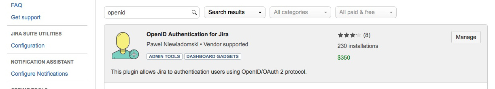
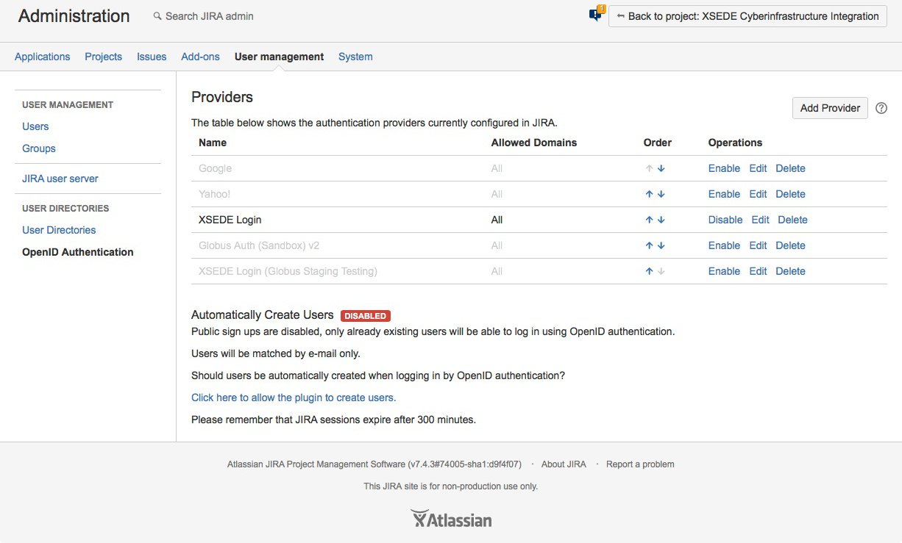
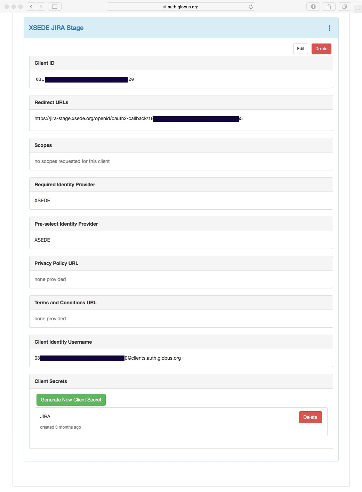

Atlassian Confluence and JIRA
=============================

Configuring OpenID based Globus Auth authentication for user access to Atlassian Confluence and JIRA.

Since Globus Auth is a standard `OpenID Connect`_ (OIDC) service we can use an existing OpenID Authentication add-on for Confluence and JIRA.

The OpenID Authentication add-on enables normal user access. By default, to access Confluence or JIRA administrative functions requires an `internal password`_.

.. _`OpenID Connect`: http://openid.net/connect/
.. _`internal password`: https://confluence.atlassian.com/adminjiraserver071/configuring-secure-administrator-sessions-802593160.html

Before you can start
--------------------

Login to Confluence or JIRA as an administrator.

Install the plug-in
-------------------

1. Navigate to "Administration -> Atlassian Marketplace -> Find new add-ons" and search for the "OpenID Authentication" add-on for Confluence or JIRA.

2. Install the OpenID Authentication add-on from Pavel Niewiadomski.
3. Obtain and configure a full or trial license.

Configure the OpenID plug-in, Part 1
------------------------------------

5. Navigate to "Administration -> Atlassian Marketplace -> Manage add-ons".
6. Under OpenID Authentication for Confluence (or JIRA) select the “Configure” option.
7. Under Providers select “Add Provider”.

In “Add Authentication Provider”:

8. Select provider “OpenID Connect/OAuth 2.0”.
9. Enter:

   Name “My Login” (or whatever label you want users to see on the login window).

   Provider URL “https://auth.globus.org”.

10. Copy the generated Callback URL for use in the next steps

Register the Globus Client
--------------------------

From a new Incognito Browser Window navigate to https://developers.globus.org/,
select the "Register your app with Globus" option, and
login using a federated identity provider.

11. Under a Project navigate to "Add new app" to register the Confluence or JIRA application.
12. Enter/paste the Callback URL from above into the Redirects field.
13. Once the application has been register click on the "Generate New Client Secret" option
14. Copy the generated client secret

Configure the OpenID plug-in, Part 2
------------------------------------

Continuing in the window from Part 1 above:

15. Enter/paste the Client Secret generated by Globus Auth above.
16. Enter/paste the Client ID from Globus Auth.
17. Enter the Scope “openid email profile”.
18. Leave “Allowed Domains” blank.
19. Select Authentication prompt “consent”.
20. Click “Add Provider”.
21. Make sure “Automatically Create Users” has the desired value.

Test the plug-in
----------------

From a new Incognitor Browser Window access your Confluence or JIRA service and authenticate using "Your Login".
