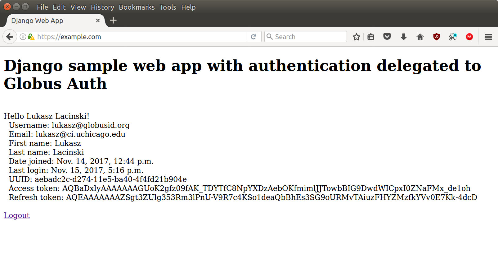

Django
======

This section shows how to build a minimal `Django`_ web application with authentication delegated to Globus Auth. The application leverages `Python Social Auth`_, which at the moment of writing this documentation seems to be the most often used middleware that provides social authentication and authorization mechanism for Python web frameworks like `Django`_, `Flask`_, `Pyramid`_, etc. The example web application you will create in this section step by step is also available in the repository. `README.md <https://github.com/globusonline/globus-integration-examples/tree/master/src/django/python-social-auth>`_ provides separate instructions describing how to deploy the application quickly.

Start new Django project
------------------------

First, we will create a virtual environment named ``venv``, activate it to run our web application in the environment and install Django and Python Social Auth packages:

.. code-block:: bash

   $ python3 -m venv venv
   $ . venv/bin/activate
   $ pip install django social-auth-app-django python-jose

In the next step, we create project ‘webapp’ with web application ‘webapp’:

.. code-block:: bash

   $ django-admin startproject webapp
   $ cd webapp/

Develop web application
-----------------------

By default, ``django-admin`` creates a web application that does not have any views. The only views available are admin views to manage users, groups, privileges, etc, provided by django.contrib.admin. We will create one simple view in the 'app' called ``home`` that displays ‘Login with Globus’, ‘Logout’ links and some information about an authenticated user. To do it, create ``webapp/views.py``:

.. code-block:: python

   from django.shortcuts import render

   def home(request):
       uuid = None
       access_token = None
       refresh_token = None
       if request.user.is_authenticated:
           uuid = request.user.social_auth.get(provider='globus').uid
           social = request.user.social_auth
           access_token = social.get(provider='globus').extra_data['access_token']
           refresh_token = social.get(provider='globus').extra_data['refresh_token']
       return render(request,
                     'home.html',
                     {'uuid': uuid,
                     'access_token': access_token,
                     'refresh_token': refresh_token})

The view returns the template, ``templates/home.html``, processed by ``render()`` function. 

.. code-block:: html

   <!DOCTYPE html>
   <html lang="en">
   <head>
       <meta charset="utf-8">
       <title>Django Web App</title>
   </head>
   <body>
       

       <h1>Django web app with authentication delegated to Globus Auth</h1>
       

             
       
           Hello {{ user.get_full_name|default:user.username }}! 
           &nbsp; Username: {{ user.username }} 
           &nbsp; Email: {{ user.email }} 
           &nbsp; First name: {{ user.first_name }} 
           &nbsp; Last name: {{ user.last_name }} 
           &nbsp; Date joined: {{ user.date_joined }} 
           &nbsp; Last login: {{ user.last_login }} 
           &nbsp; UUID: {{ uuid }} 
           &nbsp; Access token: {{ access_token }} 
           &nbsp; Refresh token: {{ refresh_token }} 
            
           <a href="?next={{ request.path }}">Logout</a>
       
           <a href="?next={{ request.path }}">Login with Globus</a>
       
       

       

   </body>
   </html>

If a user is authenticated, the page shows a username, email, first name, last name, UUID obtained from Globus Auth, and access token that can be used to call Globus services.
The template also includes ‘Login with Globus’ and ‘Logout’ links.

To make the ‘home’ view accessible, you need to add a corresponding URL to ``webapp/urls.py``

.. code-block:: python

   from django.contrib import admin
   from django.urls import include, path
   from . import views

   urlpatterns = [
       path('admin/', admin.site.urls),
       path('', views.home, name='home'),
       path('', include('django.contrib.auth.urls')),
       path('', include('social_django.urls', namespace='social')),
   ]

As you probably noticed, another two URL patterns were added. The third one is to enable the ‘Logout’ link. The last one is to support the ‘Login with Globus’ link and other URLs required by OpenID Connect protocol. Views corresponding with the two URL patterns are defined by Django and Python Social Auth.

In the last step, you need to enable the Python Social Auth middleware in webapp/settings.py and by adding:

.. code-block:: python

   ALLOWED_HOSTS = ['*']

   INSTALLED_APPS = [
       <snap>
       'social_django',
   ]

   TEMPLATES = [
       {
           ‘DIRS’: [os.path.join(BASE_DIR, ‘templates’)],
           ‘OPTIONS’: {
               ‘context_processors’: [
                    <snap>
                    'social_django.context_processors.backends',
                    'social_django.context_processors.login_redirect',
               ],
           }
       }
   ]

   AUTHENTICATION_BACKENDS = [
       'social_core.backends.globus.GlobusOpenIdConnect',
       'django.contrib.auth.backends.ModelBackend',
   ]
   SOCIAL_AUTH_GLOBUS_KEY = '<your_Globus_Auth_Client_ID>'
   SOCIAL_AUTH_GLOBUS_SECRET = '<your_Globus_Auth_Client_Secret>'
   SOCIAL_AUTH_GLOBUS_AUTH_EXTRA_ARGUMENTS = {
       'access_type': 'offline',
   }

To get OAuth2 client id and secret that you have to provide in the settings.py, register this web app on https://developers.globus.org with `https://<your_server_host_name/<prefix>/complete/globus/` (e.g. `https://example.com/complete/globus/`) as a redirect URL.

After all of the changes are made, you can create the SQLite3 database:

.. code-block:: bash

   $ ./manage.py migrate

As specified in ``settings.py``, ``manage.py`` will create SQLite3 database in ``db.qlite3`` file with all neccessary tables required by Django and Python Social Auth middleware.

Configure Apache server
-----------------------

The web app can be run behind an reverse proxy server or executed directly by an HTTP server and communicate with the server through the Web Server Gateway Interface (WSGI). Web applications on production systems usually use the latter approach. If you use Debian-based system, for example Ubuntu, add the following lines to ``/etc/apache2/sites-available/default-ssl.conf`` in ``<VirtualHost _default_:443>`` section

.. code-block:: apache

   WSGIDaemonProcess globusapp user=<your_username> python-path=<your_base_dir>/webapp python-home=<your_base_dir>/venv
   WSGIProcessGroup globusapp
   WSGIScriptAlias /<prefix> <your_base_dir>/webapp/webapp/wsgi.py process-group=globusapp
   <Directory <your_base_dir>/webapp/webapp>
       <Files wsgi.py>
           Require all granted
       </Files>
   </Directory>

The `WSGI*` directives are supported by Apache mod_wsgi module. On Debian-based systems the module is provided by `libapache2-mod-wsgi-py3` package. After restarting the Apache server, the application should be accessible at https://example.com/<prefix>.

.. _Django: https://djangoproject.com/
.. _Flask: http://flask.pocoo.org/
.. _Pyramid: https://trypyramid.com/
.. _Python Social Auth: https://python-social-auth.readthedocs.io/

