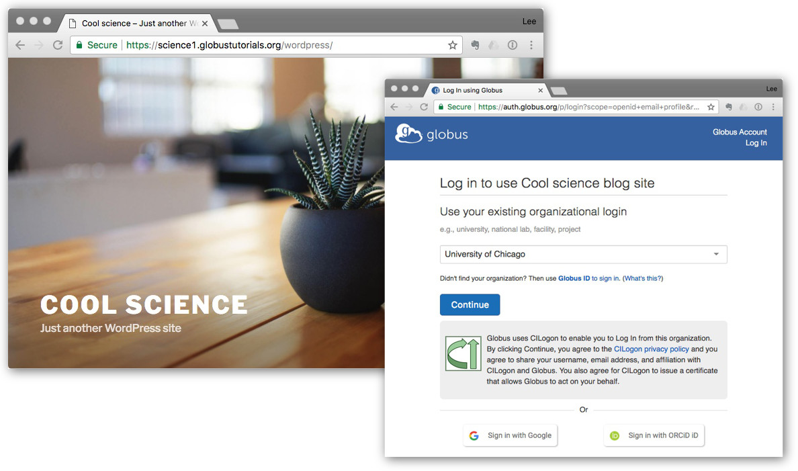
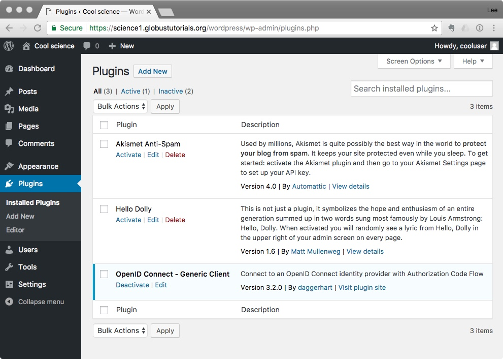
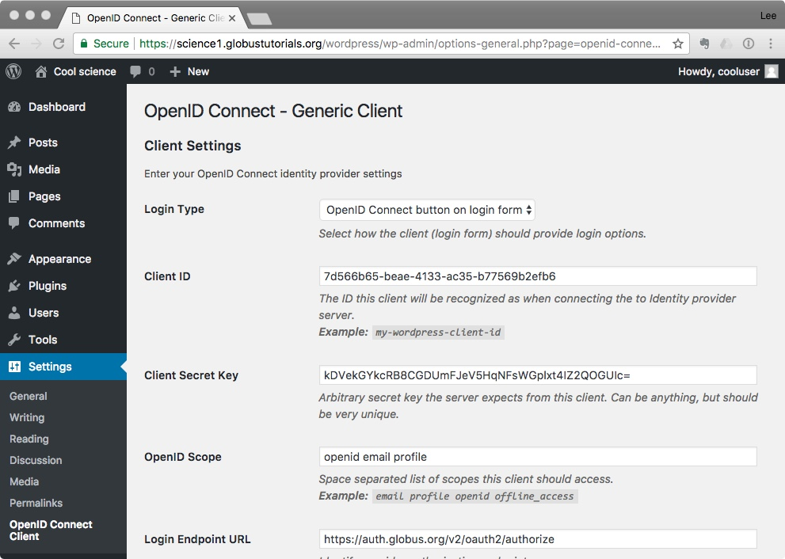
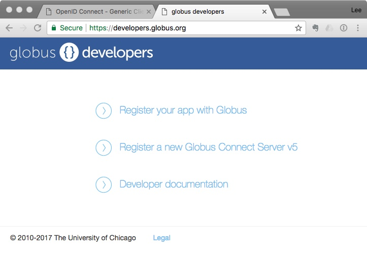
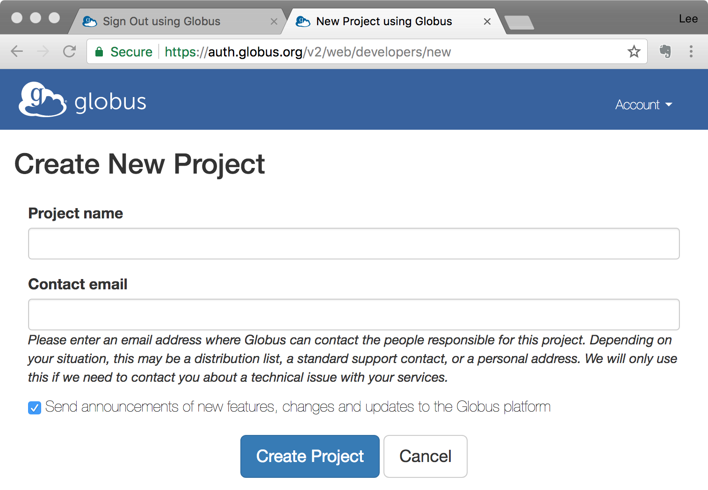
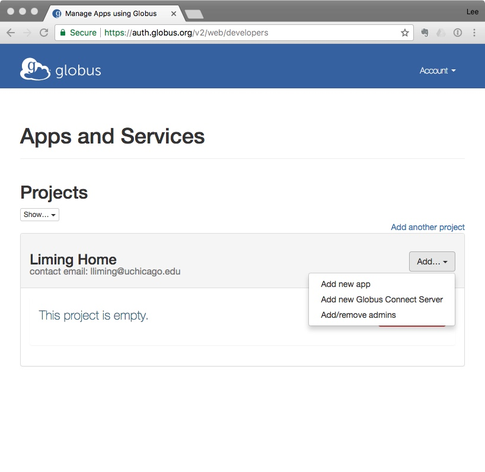
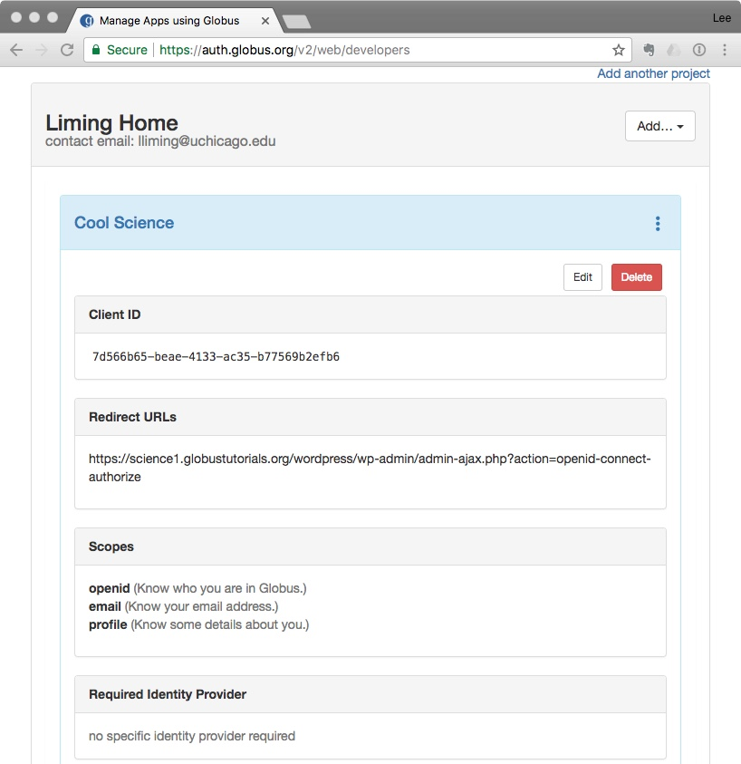
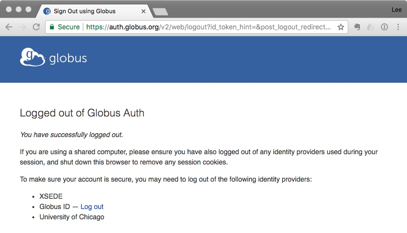
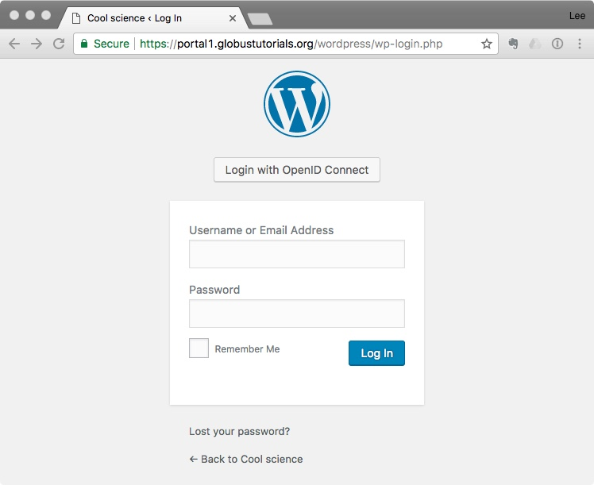
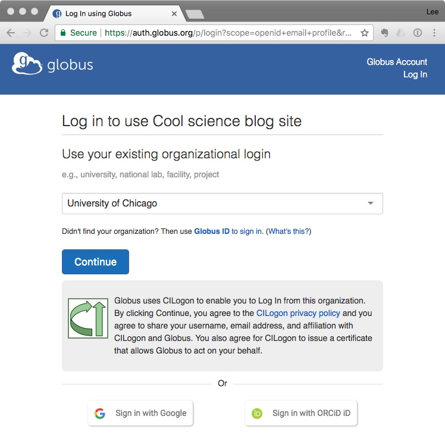

WordPress
=========

You can add Globus Auth to a WordPress site without writing any code. You’ll do most of 
the work using a Web browser. After you have a WordPress site set up, it will take about
20 minutes to add Globus Auth logins to it.

This method works because Globus Auth is a standard `OpenID Connect`_ (OIDC) service, and
there's already good support in the WordPress community for OIDC.

.. _`OpenID Connect`: http://openid.net/connect/

What you'll need
----------------

- An existing WordPress installation (`Download WordPress`_ or `Setup a WordPress host`_) 
- An `OIDC plugin for WordPress`_

Your WordPress site must have SSL/TLS security enabled to use Globus Auth. In your Web
browser, the address of your site should begin with ``https://``.  You'll have this 
automatically if you're using a hosted WordPress site. If you're running 
your own server, you'll need to obtain and install a secure server certificate. We 
recommend `Let's Encrypt`_ because it's free and because it's easy to use
with most popular Web servers.

.. _`Download WordPress`: https://wordpress.org/download
.. _`Setup a WordPress host`: https://wordpress.com/pricing/
.. _`OIDC plugin for WordPress`: https://github.com/daggerhart/openid-connect-generic
.. _`Let's Encrypt`: https://letsencrypt.org/

Make it happen
--------------

In a nutshell, the method for enabling Globus Auth logins in a WordPress site is as follows.

1. Obtain and install an OpenID Connect (OIDC) plugin for your WordPress site.
#. Activate the plugin and configure it.
#. Register your WordPress site with Globus and obtain your site's ``client_id`` and ``client_secret``.
#. Configure the plugin with your ``client_id`` and ``client_secret``.

Get an OIDC plugin
------------------

WordPress has a huge library of plugins provided by community members. The library is accessed from
your WordPress dashboard by clicking ``Plugins`` in the left sidebar, then ``Add New`` at the top
of the Plugins page. If you search for "openid connect," you'll find a large number of social login plugins 
that let people login using Google, Facebook, LinkedIn, etc. There's also a plugin called "Generic 
OpenID Connect." Ordinarily, this would be the choice we'd recommend for use with Globus. 

As it happens, there's a newer version of the Generic OpenID Connect plugin that has a nicer configuration 
interface and some cool features, so we recommend that you get the newer version. This 
version hasn't been submitted to the WordPress library, so you'll need to obtain it from GitHub. The 
GitHub repository is https://github.com/daggerhart/openid-connect-generic.git.

**If you have shell access** on your WordPress server, the easiest way to obtain and install the plugin is to
login to your WordPress server, find the plugins directory in your WordPress installation, and use
``git clone`` to install it directly.

Assuming your wordpress server is named ``coolscience.wordpress.com`` and WordPress is installed at 
``/var/www/html/wordpress``, the following commands will do this.

::

   % ssh coolscience.wordpress.com
   % cd /var/www/html/wordpress/wp-content/plugins
   % git clone https://github.com/daggerhart/openid-connect-generic.git

**If you don't have shell access** on your WordPress server, you'll need to make a copy of the plugin
on your local system, create a Zip file of the plugin, then upload it to your WordPress site.
Open a terminal shell on your local system and enter the following commands.

::

   % git clone https://github.com/daggerhart/openid-connect-generic.git
   % zip -r openid-connect-generic openid-connect-generic

You can now return to your Web browser, login to your WordPress site, click ``Plugins`` in the left
sidebar of the dashboard, click ``Add New`` at the top of the page, and click ``Upload Plugin`` 
at the top of the Add Plugins page. Choose the ``openid-connect-generic.zip`` 
file you created above, and click ``Install Now`` to install the plugin.

Activate and configure your plugin
----------------------------------

Now that you have a WordPress site with an OIDC plugin installed, the next step is to configure 
the plugin to use Globus Auth.  When logged in to your WordPress site, you should see the Dashboard 
shown in Figure 1. Click ``Plugins`` on the left-side navigation panel.

   **Figure 1.** Show your WordPress plugins.

Click ``Activate`` under the ``OpenID Connect - Generic Client`` plugin title.

Now that your OpenID Connect plugin is activated, you can configure it. Click ``Settings`` 
in the left-side navigation panel and select “OpenID Connect Client.” You’ll see the 
settings panel shown in Figure 2.

   **Figure 2.** WordPress OpenID Connect plugin settings panel.

To continue, you’ll need a Client ID, a Client Secret Key, and a few other things 
that you don’t have yet. All of these items come from Globus Auth. So now it’s time 
to register your Web application with Globus Auth.

Register your application with Globus Auth
------------------------------------------

Keep the WordPress window open and open another Web browser window. In this one, enter the address below.

  https://developers.globus.org/ 

The new window should look like Figure 3, below.

   **Figure 3.** Globus developers’ website.

Click ``Register your app with Globus.`` You’ll need to login to Globus. If possible, choose 
your home institution (college or university), or another organization where you have an 
account (like XSEDE). Use Google if you don’t have an identity at a participating research 
organization. Once you login, you should see the project screen shown in Figure 4.

   **Figure 4.** Create a project with Globus

The project you create will be a place to keep track of all of the Web app registrations 
you need for your application. (In this case, we’ll only need one, but some applications 
may need more than one.) It’s only for your use, so you can call it anything you like.

Once you have a project, add a Web app, as shown in Figure 5.

   **Figure 5.** Add a new app registration to your project.

The app registration form is shown below in Figure 6. You’ll need to complete this form using 
appropriate values for your WordPress site. 

- The ``App name`` will be displayed on your app’s login page, so enter the name of your website. 
- Leave ``Scopes`` empty. 
- The ``Redirects`` field needs to be filled with the Redirect URI provided by your WordPress OIDC plugin. 
  Go back to the WordPress window and scroll to the very bottom of the OpenID Connect configuration page. 
  The Redirect URI is shown at the very bottom of the page, as shown in Figure 6. 
- All of the remaining fields in the form can be left with default values. Click “Create App” at the 
  bottom of the form to register your app.

+------------------------------------------------+---------------------------------------------------+
|.. figure:: wordpress-images/AppRegRegister.jpg |.. figure:: wordpress-images/AppRegRedirectURI.jpg |
|   :width: 100%                                 |   :width: 100%                                    |
+------------------------------------------------+---------------------------------------------------+

**Figure 6.** Register your WordPress Web application.

When you’ve registered your Web app with Globus, you’ll be able to view the registration, 
as shown in Figure 7.

   **Figure 7.** A newly registered app in Globus.

Take special note of the ``Client ID`` field. This is the first piece of information you’ll need 
to complete your WordPress OIDC configuration below.  Select the value and copy it to your clipboard.

Finish configuring the plugin
-----------------------------

Return to your WordPress window, paste in the ``Client ID``, then complete the rest of the settings 
panel using the information in the following table.

==============================  ================================
OIDC Settings Field             Fill with...
==============================  ================================
Login Type                      *Default -* ``OpenID Connect button on login form``
Client ID                       *Copy and paste from Globus app registration*
Client Secret Key               *Scroll to the bottom of the Globus app registration view and generate a 
                                new client secret key. Name it whatever you like, and copy and paste 
                                the secret key from the Globus registration window into the WordPress 
                                window. If you lose the key, simply generate a new one.*
OpenID Scope                    ``openid email profile``        *separate each word with spaces*
Login Endpoint URL              ``https://auth.globus.org/v2/oauth2/authorize``
Userinfo Endpoint URL           ``https://auth.globus.org/v2/oauth2/userinfo``
Token Validation Endpoint URL   ``https://auth.globus.org/v2/oauth2/token``
End Session  Endpoint URL       ``https://auth.globus.org/v2/web/logout``
Link Existing Users             *Check this box!*
*Everything else...*            *...leave default values*
==============================  ================================

When you’ve finished filling out the settings panel, click ``Save Changes`` at the 
bottom of the page.  *Your work is done!*

Try it out
----------

Once you’ve configured your OpenID Connect plugin, your WordPress site is ready to 
use with Globus Auth. Sign out of the site by hovering your pointer over your 
userid in the upper-right corner of the WordPress window and select ``Log Out.`` 
You should see the Globus “Logged out” page, shown in Figure 8.

   **Figure 8.** Your new logout page.

For good measure, go ahead and click on the ``Log out`` link for Globus ID as well.

Now, when you return to your WordPress site and click ``Log in``, you’ll see the OpenID 
Connect button above the login box, shown in Figure 9. (You can change this to 
something better, like “Login with Globus,” later.)

   **Figure 9.** Your login page with OpenID Connect button.

Click ``Login with OpenID Connect,`` and you’ll see the Globus login page, shown in 
Figure 10.

   **Figure 10.** Your new login page.

Notice that the login page in Figure 10 shows the application name that you entered 
when you registered the Web app with Globus Auth. (See Figure 6 for a reminder of 
the registration page.) You can change this name at any time by returning to 
developers.globus.org and clicking ``Edit`` when viewing the app registration.

When you complete the Globus login, WordPress will create a user account for your 
Globus identity and assign the basic subscriber role to the account. The same will
happen for anyone else who logs in. When you login as an administrator, you can see 
these accounts and assign different roles where appropriate.

